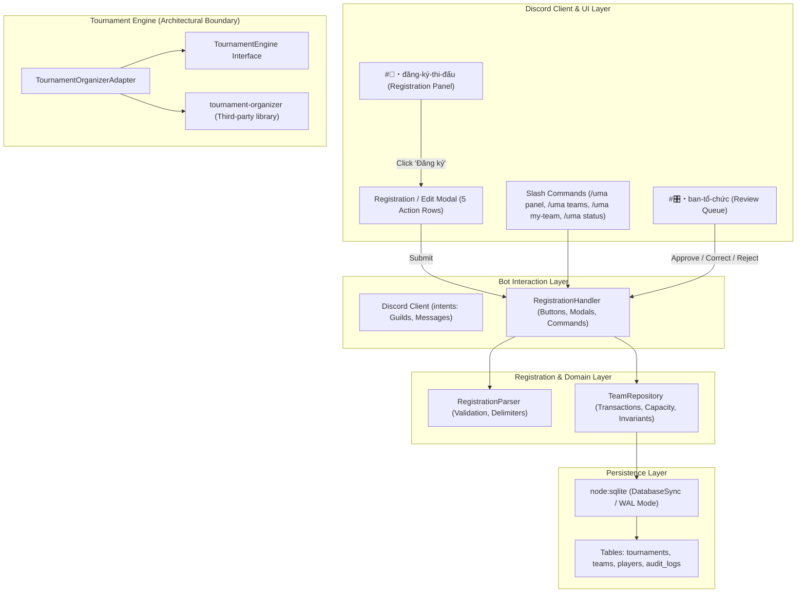

# ARCHITECTURE DOCUMENTATION — UMA TOURNAMENT BOT

> Phase 2A extension: `TournamentService` owns state transitions, eligibility, random draw and adapter orchestration; `TournamentRepository` owns check-in, seed, bracket, match and BYE persistence. `TournamentHandler` and `TournamentUI` expose the new Discord commands without expanding registration handling. See [Phase 2A implementation report](PHASE2A_IMPLEMENTATION_REPORT.md) for the current execution flow. The Phase 1 sections below document the registration architecture.

> Phase 2B extension: `MatchService` and `MatchRepository` own the operational match lifecycle. `MatchHandler` handles interactions, `MatchUI` builds Discord views, and `DiscordMatchRoomGateway` isolates private-thread API calls behind a fakeable interface. See [Phase 2B implementation report](PHASE2B_IMPLEMENTATION_REPORT.md). The diagrams below retain the original Phase 1 scope.

> Phase 3A extension: `ResultService` and `ResultRepository` own submission, evidence metadata, referee adjudication, engine advancement and champion persistence. `DiscordEvidenceGateway` owns external upload/card effects and `ResultHandler` owns interactions. See [Phase 3A implementation report](PHASE3A_IMPLEMENTATION_REPORT.md). The diagrams below retain the original Phase 1 scope.

## 1. System Overview

**UMA Tournament Bot** is an independent, Vietnamese-first Discord tournament management system designed specifically for **UMA Club**. It supports competitive **Liên Quân Mobile 5v5** tournaments at a realistic scale of 10–15 teams (stress capacity up to 16 teams) with a Single Elimination bracket format.



---

## 2. Layered Architecture

### 2.1. Discord Interaction Layer (`src/bot/`)
- **`commands/umaCommand.ts`:** Slash commands:
  - `/uma panel`: Exports registration portal (BTC only).
  - `/uma teams`: Lists all approved and pending teams.
  - `/uma my-team`: Inspects captain's team status with `[✏️ Chỉnh sửa đơn]` button when in `NEEDS_CORRECTION`.
  - `/uma status`: Shows real-time tournament capacity and registration counts.
- **`ui/RegistrationUI.ts`:** Pure UI component builders for embeds, buttons, and modals.
  - **5 Action Rows Modal:** Tailored to Discord's maximum 5 Action Rows limit (Team Name, Abbreviation, Captain Contact, 5 Starters, Optional Substitutes).
  - **Edit Registration Modal:** Pre-filled with existing roster for seamless correction resubmissions.
  - **BTC Review Card:** Visual card in `#🎛️・ban-tổ-chức` with interactive review buttons (`[✅ Duyệt Đội]`, `[✏️ Yêu Cầu Sửa]`, `[❌ Từ Chối]`).
- **`handlers/RegistrationHandler.ts`:** Dispatches and handles Discord events with authorization checks.

### 2.2. Domain & Registration Layer (`src/registration/`)
- **`RegistrationParser.ts`:** Parses multi-line roster strings with flexible delimiters (`|`, `-`, `,`, `:`).
  - Strictly enforces exactly 5 starters.
  - Enforces 0 to `maxSubstitutes` (default 2).
  - Detects and rejects intra-submission duplicate UIDs.
- **`TeamRepository.ts`:** Manages normalized entities and transactional operations.
  - **Tournament Identity Separation:** Operations scoped strictly to `ACTIVE_TOURNAMENT_ID` rather than Discord `guildId`.
  - **Atomic Capacity Enforcement:** Evaluates active teams against `max_teams` inside a database transaction lock.
  - **Domain Captain Uniqueness:** Prevents captains with active registrations from registering multiple teams, while allowing captains of rejected/withdrawn teams to register again.
  - **Correction Lifecycle:** Transitions `PENDING` -> `NEEDS_CORRECTION` -> Captain edit -> `PENDING` with atomic player row replacement while preserving `team.id`.

### 2.3. Tournament Engine Abstraction (`src/tournament/`)
- **`TournamentEngine.ts`:** Application-owned interface defining tournament lifecycle methods (`createTournament`, `registerTeams`, `startTournament`, `getBracket`, `getMatches`, `reportResult`, `resetResult`, `serialize`, `restore`).
- **`TournamentOrganizerAdapter.ts`:** Implements `TournamentEngine` wrapping `tournament-organizer@4.1.1`.
- **Architectural Decoupling Boundary:** The adapter boundary isolates third-party bracket code from application domain models, providing replacement flexibility if the underlying pairing engine needs to be substituted in the future.

### 2.4. Persistence Layer (`src/database/`)
- **Engine Choice:** Node.js native `node:sqlite` (`DatabaseSync`).
  - **Runtime Baseline:** Node.js 22+ (tested on Node 22 and 24).
  - **Justification:** High-performance, synchronous, zero-dependency SQLite built into Node.js. Avoids native C++ compilation issues on Windows.
  - **Configuration:** Foreign keys enabled (`PRAGMA foreign_keys = ON;`), WAL mode enabled (`PRAGMA journal_mode = WAL;`).

---

## 3. Normalized Database Schema

```sql
CREATE TABLE tournaments (
  id TEXT PRIMARY KEY,
  name TEXT NOT NULL,
  game TEXT NOT NULL DEFAULT 'Liên Quân Mobile',
  status TEXT NOT NULL DEFAULT 'registration_open',
  max_teams INTEGER NOT NULL DEFAULT 16,
  created_at INTEGER NOT NULL
);

CREATE TABLE teams (
  id TEXT PRIMARY KEY,
  tournament_id TEXT NOT NULL REFERENCES tournaments(id) ON DELETE CASCADE,
  name TEXT NOT NULL,
  abbreviation TEXT NOT NULL,
  captain_discord_id TEXT NOT NULL,
  captain_contact TEXT NOT NULL,
  status TEXT NOT NULL DEFAULT 'PENDING',
  rejection_reason TEXT,
  btc_review_message_id TEXT,
  created_at INTEGER NOT NULL,
  updated_at INTEGER NOT NULL
);

-- Non-unique performance indexes.
-- Active-only uniqueness (PENDING/APPROVED/NEEDS_CORRECTION) is enforced
-- transactionally inside TeamRepository.registerTeam / resubmitCorrectedTeam.
-- REJECTED / WITHDRAWN rows do NOT hold uniqueness slots — same name/tag/UID
-- may be freely re-registered after rejection or withdrawal.
CREATE INDEX idx_teams_tourney_name    ON teams(tournament_id, name);
CREATE INDEX idx_teams_tourney_abbr    ON teams(tournament_id, abbreviation);
CREATE INDEX idx_teams_tourney_captain ON teams(tournament_id, captain_discord_id);

CREATE TABLE players (
  id TEXT PRIMARY KEY,
  team_id TEXT NOT NULL REFERENCES teams(id) ON DELETE CASCADE,
  tournament_id TEXT NOT NULL REFERENCES tournaments(id) ON DELETE CASCADE,
  discord_id TEXT,
  ingame_name TEXT NOT NULL,
  game_uid TEXT NOT NULL,
  is_substitute INTEGER NOT NULL DEFAULT 0,
  slot_number INTEGER NOT NULL,
  created_at INTEGER NOT NULL
);

-- Non-unique UID index. Uniqueness against active teams enforced transactionally.
CREATE INDEX idx_players_tourney_uid ON players(tournament_id, game_uid);

CREATE TABLE audit_logs (
  id TEXT PRIMARY KEY,
  tournament_id TEXT NOT NULL,
  team_id TEXT NOT NULL,
  staff_discord_id TEXT NOT NULL,
  action TEXT NOT NULL,
  previous_status TEXT NOT NULL,
  new_status TEXT NOT NULL,
  reason TEXT,
  timestamp INTEGER NOT NULL
);
```

---

## 4. Concurrency & Idempotency Model

### 4.1. Double-Approval / Conflicting Action Race Condition
When two BTC staff members click `[✅ Duyệt Đội]` or `[❌ Từ Chối]` simultaneously on the same pending card:
- The database executes an atomic conditional update:
  ```sql
  UPDATE teams 
  SET status = 'APPROVED', updated_at = ? 
  WHERE id = ? AND status = 'PENDING'
  ```
- Only the first transaction modifies a row (`changes === 1`).
- The second transaction receives `changes === 0`, safely detecting the state change.
- The second interaction aborts cleanly with:
  `"Đơn này vừa được xử lý bởi thành viên BTC khác."`

### 4.2. Capacity Race Condition Protection
When 15 of 16 slots are filled and two captains attempt to register simultaneously:
- Each registration executes inside a `BEGIN IMMEDIATE TRANSACTION`.
- The active team count is evaluated within the transaction lock:
  ```sql
  SELECT COUNT(*) as count FROM teams 
  WHERE tournament_id = ? AND status IN ('PENDING', 'APPROVED', 'NEEDS_CORRECTION')
  ```
- Only the first transaction reads `15 < 16` and commits.
- The competing transaction evaluates `16 >= 16` and rolls back with `REGISTRATION_FULL` (`"Giải đấu đã đủ số lượng đội đăng ký."`).

### 4.3. Resubmission Concurrency & Idempotency
- When a captain resubmits a corrected roster, the transaction validates `status === 'NEEDS_CORRECTION'` and ownership before atomically replacing players and setting status to `PENDING`.
- Repeated submissions fail safely without corrupting the roster.

---

## 5. Security & Privacy Guarantees

1. **Least Privilege:** Bot requests zero Administrator permissions; operations require only channel-level Send/Manage Message permissions.
2. **Private Data Isolation:**
   - Captain contact information (`captainContact`) is strictly restricted to staff review embeds in `#🎛️・ban-tổ-chức`.
   - Public team lists (`/uma teams`) omit phone/Zalo contacts and raw UIDs.
3. **No Secret Leakage:** `.env` is strictly ignored; `.env.example` contains only placeholder schema. CI runs fully isolated with mock configurations.

---

## 6. Single-Instance Deployment Assumption (v1)

> **IMPORTANT:** UMA Tournament Bot v1 is designed and tested under the assumption that **exactly ONE bot process** runs against **ONE SQLite file** at any point in time.

### What this means in practice
- `node:sqlite`'s `DatabaseSync` is synchronous within a single Node.js event loop.
- `BEGIN IMMEDIATE TRANSACTION` inside `TeamRepository` acquires a write lock immediately, serializing concurrent within-process operations (e.g., two button interactions processed in the same tick).
- This is **NOT** a multi-process or multi-server concurrency solution. Two separate bot processes pointing at the same `.sqlite` file could produce `SQLITE_BUSY` contention or write conflicts.

### If multi-instance is introduced in the future
- Review all `BEGIN IMMEDIATE` transaction retry policies.
- Consider upgrading to a client/server database (e.g., PostgreSQL) or adding a `busyTimeout` / exponential back-off for SQLite.
- Update this section with the revised concurrency model.

### Current scope
For UMA Club's scale (10–15 teams, one bot instance per server), single-process SQLite is safe, simple, and sufficient.

---

## 7. Future Phase Roadmap (Deferred)

- **Phase 2:** Check-in management, dynamic match thread spawning, live bracket Discord embed updates.
- **Phase 3:** Match result reporting, screenshot evidence attachment verification, referee dispute handling.
